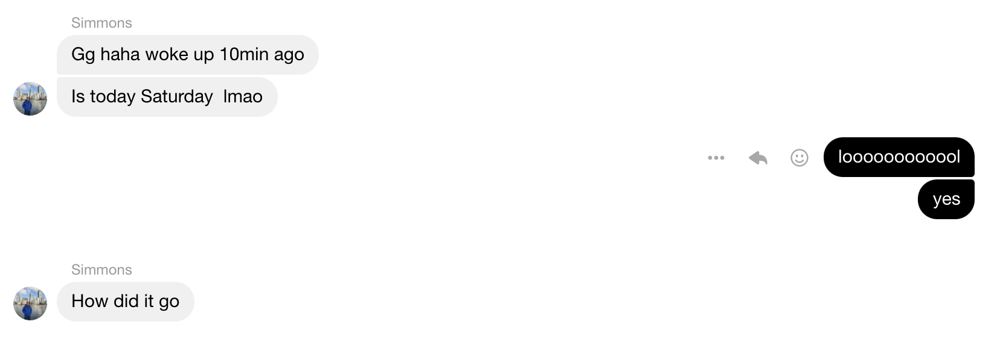

https://mapscontest.com/

https://maps20.kattis.com/problems

a somewhat respectable 115/360ish place with only Karthik and I competing (because Pasha didn't realize it was on Saturday not Sunday and he woke up when it was basically over xD)

I personally did [D](https://open.kattis.com/problems/greedypolygons), [G (a very socal icpc-esque problem)](https://open.kattis.com/problems/litespace), and [H](https://open.kattis.com/problems/magicalcows), and started attempting [C](https://open.kattis.com/problems/easymultiplication), but I wasn't really on the [right track](https://codeforces.com/blog/entry/74977?#comment-594267)

