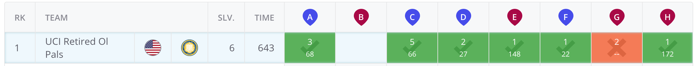

ICPC North America Qualifier 2020  
https://naq20.kattis.com/  ([there was also an open contest](https://open.kattis.com/contests/naq20open))

Did this contest with my friend alex.

I solved AEH and he solved CDF and was working on G.

We were rank 44 out of the approx 370 competitors who solved at least 1 problem.

A: find the largest strongly-connected component  
E: sum up all p_e. At worst we'll need this many patrollers.  We can save patrollers by using the same patroller for 2 consecutive edges.  Each time we use the same patroller for 2 consecutive edges, we shave off 1 from the worst-case.  How many saves?  For each junction (vertex), how many pairs can we form between its edges?  Example: a vertex has edges a,b,c with weights (p_e) 4, 3, and 5.  a can share 1 patroller with b and 3 with c. b can share 2 patrollers with c.  so out of the worst-case 4+3+5=12 patrollers, we can save 6.  In general we can always pair them all up unless there's some edge whose size dwarfs the rest (e.g. 6,1,1), or if they're odd (there will be 1 left unpaired).  
H: 3D DP

