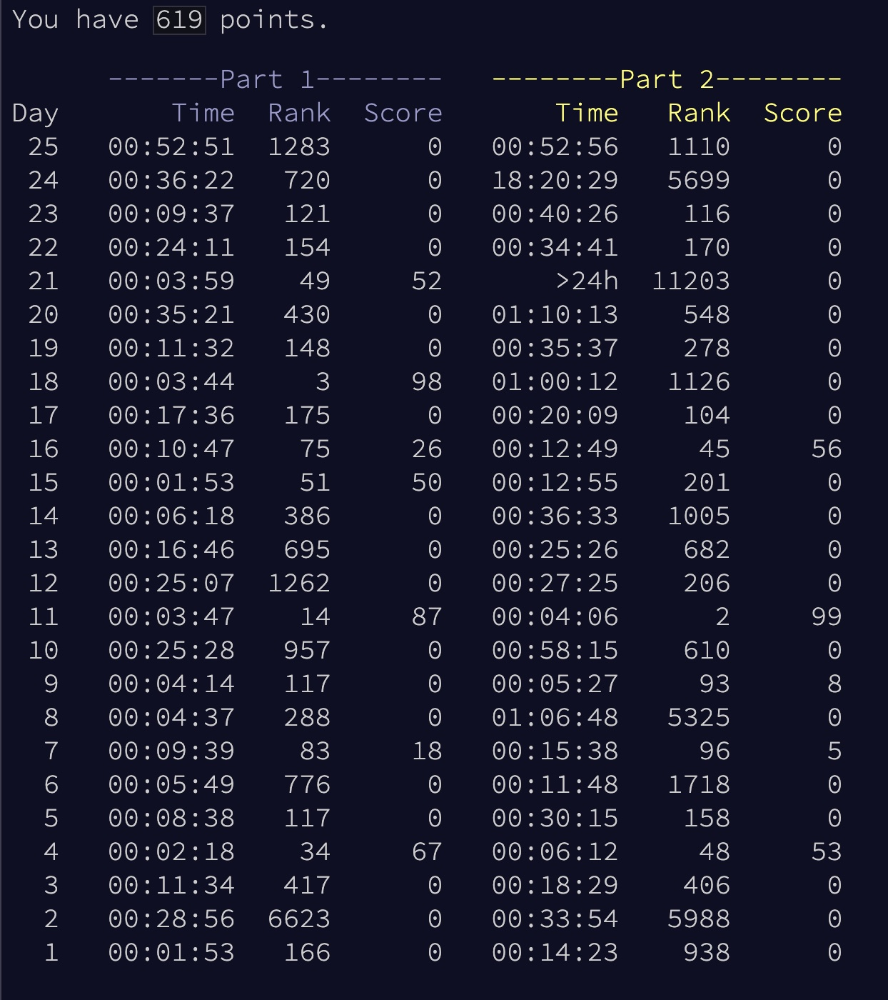

Wow, it's year 7 since I submitted my first AoC solution ever (2017), and it's the 5th year (since 2019) where I take it "seriously" and do the problems every day to try to get on the overall leaderboard. That's much longer than it feels like to me! I think in my mind I'm still whatever age I was in 2020.

Still on the east coast this year, and furthermore I'm back in school, with an 8:30 AM class, so the midnight start times are the roughest they've ever been for me.

I started using Github Copilot (AI autocomplete) a few months ago, and I've used it for these problems. Sometimes it helps greatly, saving me tons of keystrokes and dozens of seconds. It's also allowed me to avoid activating my brain or pencil/paper to figure out how exactly some repeated rules should be: if I just write a rule once, copilot usually infers how to mechanically repeat the rule for the other cases. However, this has bitten me in the ass a few times when it did a bad job, I assumed it was correct without checking, and had to waste much more time debugging due to it.

I also started writing my own AOC CLI tool: https://github.com/VitamintK/wang-aoc-cli  
I really could have just used one that someone else wrote, like https://github.com/wimglenn/advent-of-code-wim, but it's been satisfying to make my own. Up until and including Day 16, I haven't implemented any real time-savers yet (like running on example and real at the same time, and submitting from the CLI), but the command to download the input directly instead of copy-pasting saves me ~2 seconds every day, and the command to automatically create the files (.py, .in) that I use have been nice quality-of-life changes that mean that I only have to get to my computer by 11:59 instead of 11:57.  
For Day 17, I did implement those real time-savers, which I imagine will shave off one to two dozen seconds every day. 

Barely missed the leaderboard again this year :(

