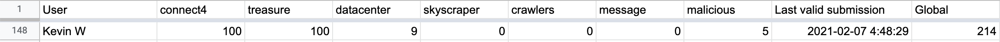

[quora programming challenge 2021 (div 2)](https://codeforces.com/blog/entry/86539)

There were two contests (same difficulty) on the same day, named div 1 and div 2.  This is div 2.

[results in a google sheet](https://docs.google.com/spreadsheets/d/1xVzryOFrhq7G9YpePcstexg8owvQPyev7EOXogdaI2c/edit#gid=1468680752)

tourist got first place in div 2.  I started 90 minutes late bc I had the starting time late by an hour and also got caught up chatting with my neighbor for half an hour.

I somehow got 148th place (out of the about 300 competitors who solved at least one problem) despite only solving the trivial A and the easy dp B, brute-force partial-credit on C (I also think I fixed a bug on C to get the medium case like 20 seconds after the contest finished), and a couple middling points on ML problem H.

